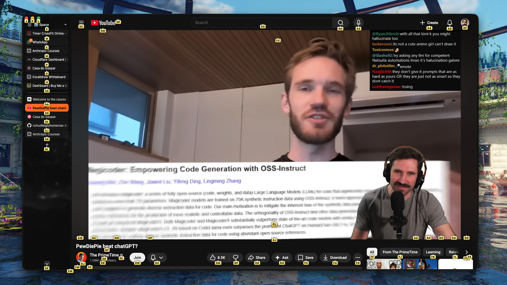
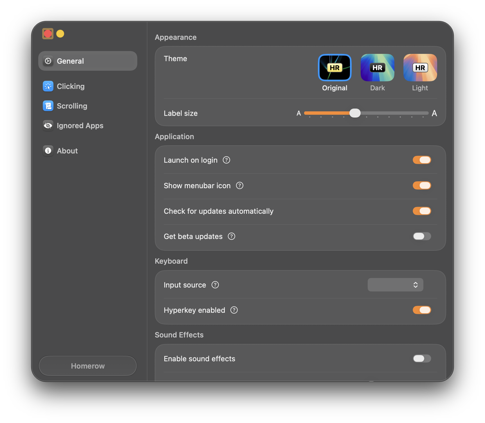

**What I mean by Productivity in this article:**

- Apps that improve the way I interact with the SO and it's software.
- In my case interaction is made by HomeRow as I'm a touch typist.
- HomeRow is how the rest position of your hand over the keyboard is called with the fingers over asdf jkl;.
- Apps on this article: [HomeRow](https://github.com/nchudleigh/homerow), HRM, Raycast.

**Can you type without looking at the keyboard?**

- I don't think that people that can't type with all ten fingers and without looking at the keyboard will take the most
  of these tools. To be really sincere I think most of the tools of the article can make you even slow.
- But if you're here because you're starting to think about learn some new skills, take the opportunity to learn how to
become a touch typist.
- Free typing training: [KeyBr](https://www.keybr.com/pt-br) and [EdClub](https://www.edclub.com/sportal/program-3.game)

I know Productivity can have many faces and I'm not defining a limiter here, by other standards I can make another article
in the future where I put **Nvim+Tmux** or **Obsidian/Notion** as Productivity tools, but for the scope of today theme we're
talking about HomeRow Productivity type of apps.

## HomeRow the app

These yellow boxes with letters inside are from an app called [HomeRow](https://github.com/nchudleigh/homerow) -- I know
what you're thinking about, it's the same name of the hand position I talked about earlier

> [!NOTE]
> The creator of the app should have choose a better name for it, as even to search for it became a pain because of the
> amount of other apps for HomeRow (position) that appears on the results.

The app triggers with a shortcut `Shift+CMD+Space`.  
In the image above I can navigate direct by the keyboard and click on anything on the screen that is interactive.

Like the video: `DM`  
Dislike: `DF`  
Select the search bar: `SG`  
Close the browser: `J`  
Even the scroll has a shortcuts based on vim motions.  
Change the tabs? Just choose one of from the bunch and voilà.

As you can see it's a GUI app pretty easy to use, it's a out of the box solution, you just install set a shortcut to
trigger it and start to use.

[HomeRow repository](https://github.com/nchudleigh/homerow)
But the easiest install is via home brew with `brew install homerow`

> It's free to use but has a small pop-up that'll sent you to a page to buy it paid version and help the project, and I
> must say it's well deserved, the app is really well made and polished.
So show some ~love~ money to the dev.
