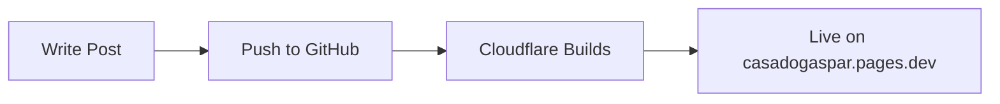

## Introduction

 I'm a very pragmatic person and so I found that that's the best place to keep my Cheat Sheet for markdowns.

This is a paragraph of regular text. It can contain **bold**, *italic*, ~~strikethrough~~, and `inline code`. You can
also add [links like this](https://casadogaspar.pages.dev).

---

## Code Blocks

Here's some Python:

```python
def greet(name: str) -> str:
    return f"Hello, {name}!"

print(greet("Gaspar"))
```

And some bash:

```bash
git push origin main
hugo server -D
```

---

## Blockquote

> The best way to get started is to quit talking and begin doing.
> — Walt Disney

---

## Lists

**Unordered:**

- Item one
- Item two
  - Nested item
  - Another nested item
- Item three

**Ordered:**

1. First step
2. Second step
3. Third step

---

## Table

| Tool | Purpose | Free |
|---|---|---|
| Hugo | Static site generator | ✅ |
| FixIt | Theme | ✅ |
| Cloudflare Pages | Hosting | ✅ |
| GitHub | Source control | ✅ |

---

## Image


---

## Admonition Shortcodes


This is a tip admonition. Great for highlighting useful information.



This is a warning. Use it to flag potential issues.



This is an info box. Perfect for side notes.



This is a tip admonition. Great for highlighting useful information.



This is a warning. Use it to flag potential issues.



This is an info box. Perfect for side notes.



This is a tip admonition. Great for highlighting useful information.



This is a warning. Use it to flag potential issues.



This is an info box. Perfect for side notes.



This is a tip admonition. Great for highlighting useful information.



This is a warning. Use it to flag potential issues.


Other options for admonitions:
> tip, warning, info, note, danger, success, question, quote, bug, example, abstract

---

## Mermaid Diagram



---

## Conclusion

I need to put more tricks specific for Hugo here as they are pretty powerful. 🚀
