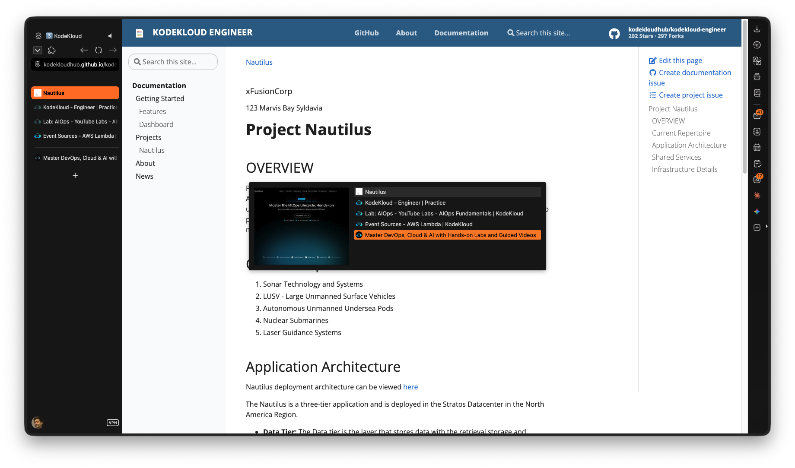
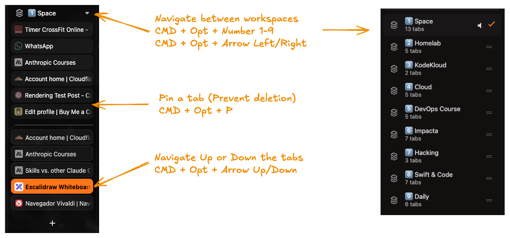
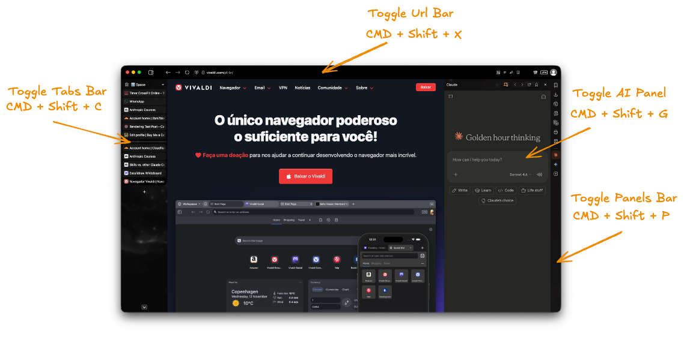
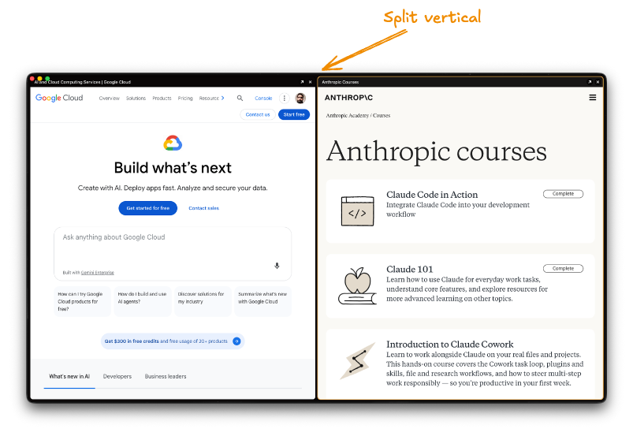
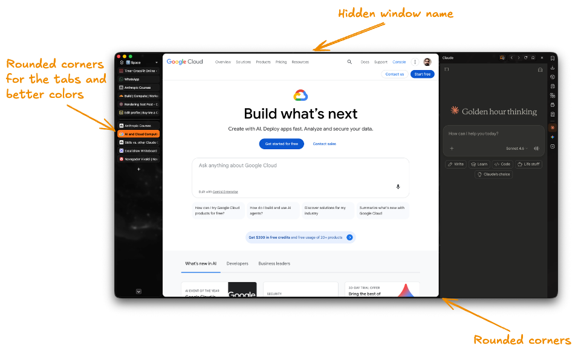

## **First things First**

> **Watch out:** The release of Vivaldi 8.0 made a lot of my customizations unnecessary or deprecated — an update to this article is necessary.

**What this post isn't:**

- A deep tutorial about Vivaldi features.
- A paid Ad.
- The best way to use Vivaldi ever.

**What this post is about:**

- How I use it for my workflow.
- The configs and keybindings that make sense for me.
- A way for you see if this browser make sense for you.

## **Why Vivaldi?**

Three main points!

1. I was after the browser that runs on less ***RAM*** usage possible, and it's a problem because most of the time the
   sites are
part of the problem too, as web developers have a tendency to ~~not care about resources usage~~ use too much resources
to create their sites.

2. ***Vertical tabs*** and ***Workspaces*** It's way better than having the tabs at top consuming vertical space, of
   having all the things I need ready to.

3. Customizable! In special keybindings, I'm what people call a power-user, the never touch the mouse, ***Nvim+Tmux***
   no life
   configs hacker.

### **Hibernation**

Vivaldi has a feature where it 'hibernate' the tabs after sometime, but as it allows to customize this, I use a
 shortcut ***CMD+Shift+W*** to unload all the other Tabs from memory manually, and other one to unload from the other
 workspaces too, this way I can free memory on demand and stop unnecessary swap on the SSD

### **Vertical Tabs + Workspaces**

 How long it took to people notice that we don't need the tabs taking our vertical space? It make the organization so
 much easier for power-users that most of the time have +10 tabs opened.

> Updated:
As the older still holds true, I discovered this other way to navigate thru the tabs.
By using the same shortcut `opt+shift+arrow-up/down` I'm able to navigate on a pop-up view that only triggers the tab
loading after key release, and it's way better for my navigation.

In the image I let the lateral vertical tabs opened just to serve as reference, but the pop-up in the middle of the
screen is the new hero here, as you can see it navigates while showing a preview of whats open in the tab. **It's a must**
and I cannot live without it anymore!


 And even better being used together with the workspaces separating my stuff by context, I have the sites that I opened
 but hibernated on each workspace. So if I'm studying/working I'm not looking at unrelated stuff and at least for me it
 work as a guardrail to enforce good discipline habits.

I like the toggle behavior for any kind of panel/window or similar where the same keybinding open and close it.

---

### **Keybindings**

 For me it's a instant deal break if I can't define my custom keybindings, in special to free real state and navigation.
Bellow are some that I use to keep things clean, as you can see it's possible to hide even the URL bar.


Bellow is like I use the browser normally, with an eventual AI panel being open as
I'm using it more than I
use Google search these days.

### Shortcuts I use daily, some are custom

| Command | Shortcut |
| --- | --- |
| Close Tab | `⌘W` |
| Find in Page | `⌘F` |
| Focus Address Bar | `⌘L` |
| Copy URL | `⌥⌘C` |
| New Private Window | `⇧⌘N` |
| New Tab | `⌘T` |
| Page Refresh | `⌘R` |
| Page Reload (No Cache) | `⇧⌘R` |
| Pin Tab | `⌥⌘P` |
| Reopen Closed Tab | `⇧⌘T` |
| Tab Move Backward | `⇧⌘↑` |
| Tab Move Forward | `⇧⌘↓` |
| Toggle Panel | `⇧⌘P` |
| Toggle Developer Tools | `⌥⌘I` |
| Toggle Claude Panel | `⌘G` |
| Toggle Address Bar | `⇧⌘X` |
| Toggle Force Dark Mode | `⇧⌘D` |
| Toggle Panel | `⇧⌘P` |
| Toggle Tab Bar | `⇧⌘C` |
| Toggle UI Autohide | `⇧⌘/` |
| Workspace Switch 1-9 | `⌥⌘1` to `⌥⌘9` |
| Workspace Switch Back | `⌥⌘←` |
| Workspace Switch Forward | `⌥⌘→` |
| Settings | `⌘,` |

---

### ***Split View***  

I only use the vertical split, but I let the horizontal one configured too, and third one to reset both to the normal.


| Command          | Shortcut      |
| ---------------- | -----------   |
| Split vertical   | `Shift+Opt+\` |
| Split horizontal | `Shift+Opt+-` |
| Split reset      | `Shift+Opt+=` |

The CSS part

### ***Custom CSS***

This is totally unnecessary and fruit of having too much time and Anthropic Pro plan, so why not use Claude Code to make
some custom CSS for me?

If you just installed Vivaldi maybe you found it's not exactly the most beautiful browser among the competition, in
special if you're a Arc, Zen, Dia user.

The last browser I was using was Zen, and it's beautiful! Just a little too resources hungry at the moment, in special
the rounded style and vertical tabs appearance, so why not ask my slave Claude to give it a try to beautify Vivaldi as well.

Nothing to write home about, but some sincere cherry in the cake.

```css
/* Remove the titlebar of the browser as hidden the url keeps the header name */
#header, #titlebar {
    display: none !important;
}

/* Make the tabs container be a little lower than the top */
#tabs-container.left {
  margin: -2px 0 4px 4px; /* Matches your 4px webview margin */
  padding: 20px 0 0 0; /* This is in order for the workspace name don't stay under the semaphore */
}

/* Change the background of ONLY the active/focused tab to Orange */
.tab.active {
  background-color: #FF7518 !important; /* Replace with your color */
  color: #000000 !important; /* This is the text color */ 
  font-weight: bold !important;
}

/* I removed a lof of the old CSS here as the Vivaldi 8.0 read my mind and put many of 
my custom preferences as default */
```

The result is the bellow, and well... I just noticed that my minimalist changes don't appear this good on this image,
it doesn't look as good as it's on a real high
res screen.



> If you liked what you saw here but aren't sure to give it a try because I didn't cited any specific need you have, give it a try — it's highly probable it'll have it.
